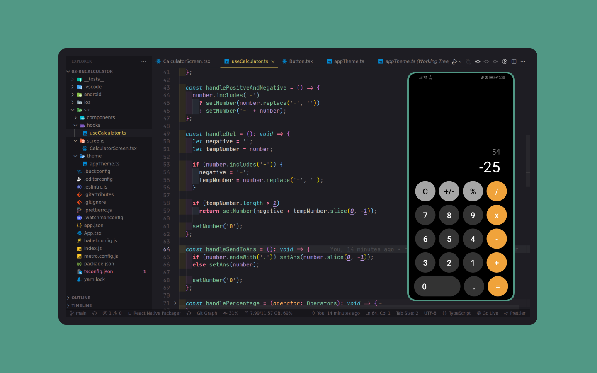

# iOS Calculator ⚛️

iOS Calculator Clone using React Native



## 🏃 Run Locally

Clone the project

```bash
  git clone https://github.com/NikolaM-Dev/rn-calculator
```

Go to the project directory

```bash
  cd rn-calculator
```

Install dependencies

```bash
  yarn
```

Start the server

```bash
  # Load metro
  yarn start

  # IOS
  yarn ios

  # Android
  yarn android
```

## ©️ Copyright

**`LICENSE`**: MIT

Check the file [here](./LICENSE)
